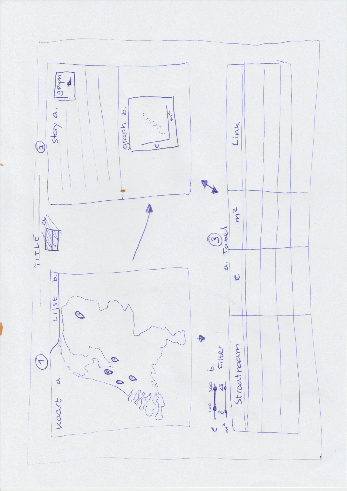

# project
programmeerproject

# The problem 
 
The problem that will be tackled with this product is geared towards students in The Netherlands whom are searching for a room to live in. Currently, different room offering websites exist and the offerings are hence scattered across different platforms. The aim of this product is to offer current listing and visualization of prices and surface of the rooms that are offered in the different major student cities in The Netherlands.
 
# Proposed features of the product 
 
Map of The Netherlands with all big cities which are all clickable 

When a city is clicked on a map: a scattergraph next to the map visualizes the relationship between price and surface of a given city. 

When a city is clicked on the map: a table below the map gives a listing of the current available rooms. 

A filter option for the listing table based on price and surface. 
 
# Required data sources
 
I will need to scrape different room websites and recover price, surface, street, city and link to the room offering. Furthermore, I will have to format this data in csv or json format in order to visualize the data with d3. 
 
# Separate parts of the application
 
The map is the most important part of this product. This map will be linked to the scattergraph and the listing. Furthermore, the listing will be filterable. Finally, a compelling story around the product should be proposed. 
 
# External components
 
For the scraper, I’m going to use BeautifulSoup, which is a scraping library for python. For the map and scattergraph, I will use d3 and topojson. 
 
# Technical problems and limitations
 
It will be crucial to build a scraper which collects the same data across the different websites. This way the data may be visualized. 
Also, because of the multitude of data points in the table, I will have to implement the possibility to first visualize the first 100, then the next 100, etc. 
 
 
 
# Review of related visualizations
	
Unfortunately or fortunately, this problem has never been tackled in this way. At least, I couldn’t find similar visualizations.
 
# MVP
 
All parts of this project constitute an important part of the end product. The map visualization and the table constitute the two most important parts. The scattergraph and storytelling are secondary elements, but complement the two major parts of the product. 

# Design draft 

 
 
 
